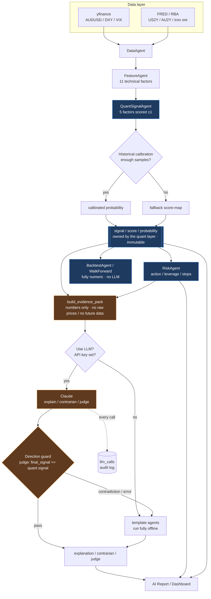

# AlphaFX Architecture

End-to-end flow from data to signal to explanation. The key boundary: the quant
layer owns the signal; the LLM only explains it and never sets it.

Blue = quant layer (owns the signal). Orange = LLM layer (explains only).

Two boundaries are explicit in the diagram:

1. `BacktestAgent / WalkForward` reads straight from the signal — the LLM is
   never in the backtest or walk-forward loops.
2. The direction guard sends every contradiction or error back to the template
   agents, and the judge's `final_signal` is forced to equal the quant signal.

See [DESIGN.md](../DESIGN.md) and [ROADMAP.md](../ROADMAP.md) for the LLM layer
design and the V2.6 plan.
