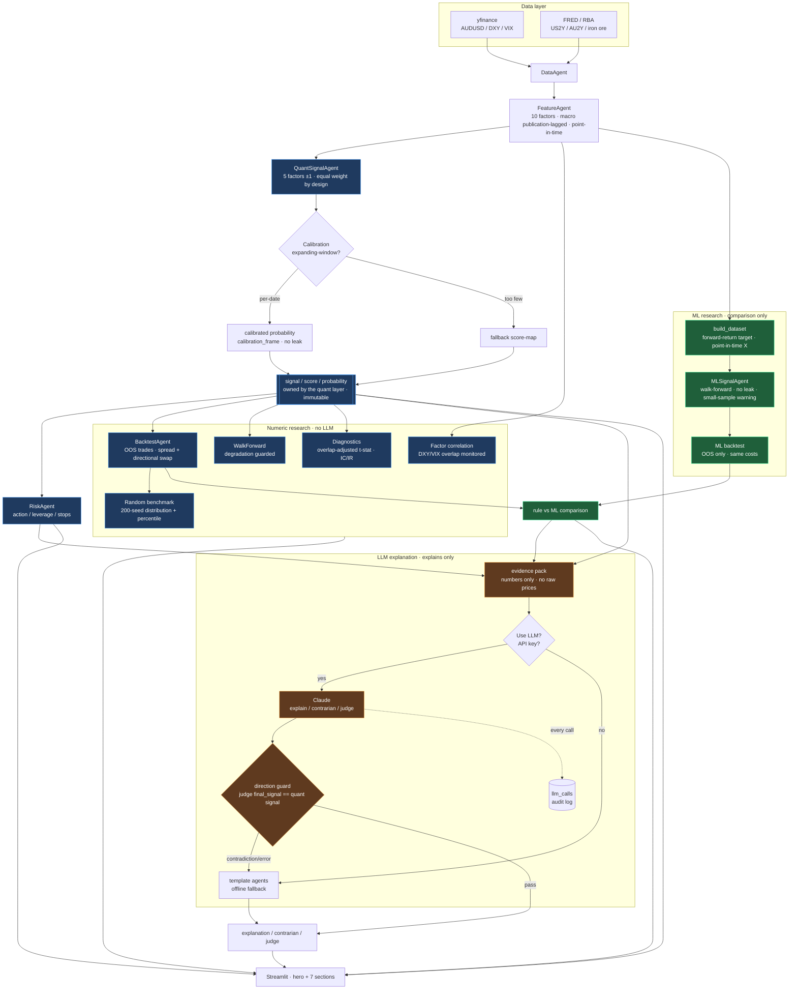

# AlphaFX Architecture

End-to-end flow from data to signal to research outputs and explanation.

Two boundaries are load-bearing:

1. **The quant layer owns the signal.** The LLM only explains it (and is never in
   the backtest, walk-forward, or ML loops). The ML model is a research
   comparison only — the rule signal stays primary/live.
2. **No look-ahead.** Macro factors are publication-lagged (point-in-time),
   calibration is expanding-window, and the ML backtest uses out-of-sample
   predictions only.

Blue = quant layer (owns the signal). Green = ML research (comparison only).
Orange = LLM explanation (explains only).

See [DESIGN.md](../DESIGN.md) and [ROADMAP.md](../ROADMAP.md) for the layer
designs and version history.
