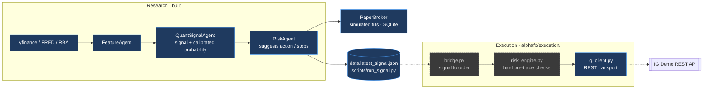

# Execution Flow

How a signal would become an IG Demo order — and every place that is currently
blocked. Companion to [architecture.md](architecture.md), which covers the
research pipeline that produces the signal in the first place.

**Nothing in AlphaFX places an order today.** The execution layer exists, but the
two gates in front of it (`risk_engine`, and the signal-quality gate) are not
built and not open. This document marks what is real and what is not.

## Where execution sits



Solid blue is built and tested. Dashed grey is step A.2/A.3, not yet written —
so the dotted arrows are the paths that do not exist yet.

## The refusal chain

An order has to survive every one of these. They are listed in the order they
run, and each one alone is enough to stop the trade.

```mermaid
flowchart TD
    S[signal] --> G1{RiskAgent<br/>evidence + confidence}
    G1 -- fallback prior only --> N1[NO TRADE]
    G1 -- extreme volatility --> N2[NO TRADE]
    G1 -- prob below MIN_CONFIDENCE --> N3[NO TRADE]
    G1 -- pass --> G2{risk_engine<br/>step A.2 · not built}
    G2 -- monthly loss over 5% --> N4[refuse]
    G2 -- drawdown from peak over 15% --> N5[refuse]
    G2 -- major data release within 2h --> N6[refuse]
    G2 -- pass --> G3{ig_client.open_position}
    G3 -- no stop_distance --> N7[IGError]
    G3 -- size over MAX_SIZE --> N8[IGError]
    G3 -- pass --> G4{execute_demo.py<br/>step A.3 · not built}
    G4 -- no --live flag --> N9[dry-run: log only]
    G4 -- pass --> IG[[POST /positions/otc]]
    IG --> C{GET /confirms/ref<br/>dealStatus}
    C -- REJECTED --> N10[no position]
    C -- market not TRADEABLE --> N10
    C -- ACCEPTED --> POS[position open]

    classDef stop fill:#5f1f1f,stroke:#ff6b6b,color:#fff;
    class N1,N2,N3,N4,N5,N6,N7,N8,N9,N10 stop;
```

The `ig_client` checks duplicate `risk_engine`'s on purpose. `risk_engine` is the
gate; the client's are the last line of defence if the gate is ever bypassed.

## Inside ig_client

The part that is easy to forget: **auth is v3 OAuth with a 60-second token**, and
**opening a position is asynchronous**.

```mermaid
sequenceDiagram
    participant C as IGClient
    participant IG as IG Demo API

    Note over C: credentials read in __init__,<br/>never at module level
    C->>IG: POST /session (Version 3)
    IG-->>C: accountId + oauthToken (expires_in 60s)
    Note over C: store refresh_token,<br/>set Authorization: Bearer + IG-ACCOUNT-ID

    rect rgb(40,40,55)
        Note over C,IG: every business call goes through _request()
        C->>C: _ensure_token() — expired?
        C->>IG: POST /session/refresh-token (Version 1)
        IG-->>C: new access_token
        C->>IG: GET /markets/{epic} (Version 3)
        IG-->>C: bid / offer / marketStatus
    end

    C->>IG: POST /positions/otc (Version 2, stopDistance required)
    IG-->>C: dealReference — an ACKNOWLEDGEMENT, not a fill
    C->>IG: GET /confirms/{ref} (Version 1)
    IG-->>C: dealStatus ACCEPTED or REJECTED
```



Three things that bite:

1. **The Version header differs per endpoint** and is not interchangeable. A
   wrong one returns a 404 HTML error page rather than JSON — `check()` detects
   that case specifically and says so.
2. **`dealReference` is not a position.** Only `dealStatus == "ACCEPTED"` from
   `/confirms/` means filled. Weekend `marketStatus` is not `TRADEABLE`, so
   orders are rejected there.
3. **The access token lasts ~60 seconds.** `_ensure_token()` renews 10 seconds
   early on every call, so a long-running script does not 401 halfway through.

## What is deliberately absent

- **No candles/history method.** IG's price endpoint burns a weekly quota
  (~10k points, 1 candle = 1 point) and prices already come from
  yfinance/SQLite. A test asserts the method stays absent.
- **No live host.** `BASE_URL` is pinned to `demo-api.ig.com` in the module, not
  in `config.py`, so it never reads as a tunable parameter. A test asserts it.
- **No LLM anywhere in this package.** The LLM explains and critiques; it is
  never in a path that can move money.

## Verifying it yourself

```bash
.venv/bin/python -m pytest tests/test_execution.py -v  # 24 tests, offline, no quota
.venv/bin/python -m alphafx.execution.ig_client        # real Demo login + quote
```

The second command places nothing. On a weekend it prints a `marketStatus` other
than `TRADEABLE`, which is the expected result, not a fault.
