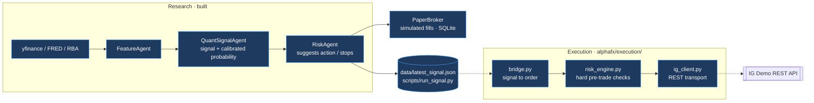
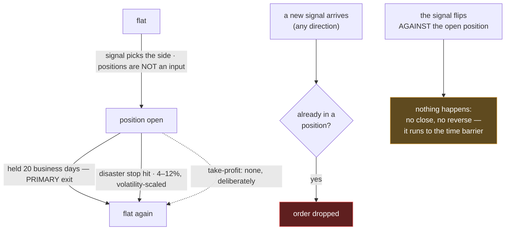

# Execution Flow

How a signal would become an IG Demo order — and every place that is currently
blocked. Companion to [architecture.md](architecture.md), which covers the
research pipeline that produces the signal in the first place.

**Nothing in AlphaFX places an order today.** The chain is now complete end to
end — signal file, gate, transport — and it refuses everything:
`EXECUTION_ENABLED` is False until the signal-quality gate opens, which makes
`execute_demo.py --live` inert by construction, and the event-blackout calendar
only covers 2026-08-15 to 2026-09-30 (it refuses outside that window). What the dry-run does produce is a log of the order it
WOULD have sent, run after run, to compare against the paper book.

## Where execution sits



Everything in the diagram is built and tested. What stops an order is not a
missing part — it is `EXECUTION_ENABLED`, plus an empty blackout calendar.

## The refusal chain

An order has to survive every one of these. They are listed in the order they
run, and each one alone is enough to stop the trade.

```mermaid
flowchart TD
    S[signal] --> G1{RiskAgent<br/>evidence + confidence}
    G1 -- fallback prior only --> N1[NO TRADE]
    G1 -- extreme volatility --> N2[NO TRADE]
    G1 -- prob below MIN_CONFIDENCE --> N3[NO TRADE]
    G1 -- pass --> G2{risk_engine}
    G2 -- monthly loss over 5% --> N4[refuse]
    G2 -- drawdown from peak over 15% --> N5[refuse]
    G2 -- major data release within 2h --> N6[refuse]
    G2 -- signal over 1 business day old --> N4b[refuse]
    G2 -- position on the same underlying --> N5b[refuse]
    G2 -- spread over 25% of the stop --> N6b[refuse]
    G2 -- stop too wide to size at 1% --> N6c[refuse]
    G2 -- EXECUTION_ENABLED is False --> N6d[refuse]
    G2 -- pass --> G3{ig_client.open_position}
    G3 -- no stop_distance --> N7[IGError]
    G3 -- size over MAX_SIZE --> N8[IGError]
    G3 -- pass --> G4{execute_demo.py}
    G4 -- no --live flag --> N9[dry-run: log only]
    G4 -- pass --> IG[[POST /positions/otc]]
    IG --> C{GET /confirms/ref<br/>dealStatus}
    C -- REJECTED --> N10[no position]
    C -- market not TRADEABLE --> N10
    C -- ACCEPTED --> POS[position open]

    classDef stop fill:#5f1f1f,stroke:#ff6b6b,color:#fff;
    class N1,N2,N3,N4,N4b,N5,N5b,N6,N6b,N6c,N6d,N7,N8,N9,N10 stop;
```

The `ig_client` checks duplicate `risk_engine`'s on purpose. `risk_engine` is the
gate; the client's are the last line of defence if the gate is ever bypassed.

## What decides BUY vs SELL — and what an open position does

Direction comes **only** from the signal. Nothing in the chain that picks a side
takes positions as an input: `QuantSignalAgent` emits bullish/bearish/neutral,
`RiskAgent.suggest()` turns that into `BUY` / `SELL` / `NO TRADE`, and
`build_order_intent()` formats it. Check their signatures — no position argument
appears in any of them.

Positions are consulted in exactly one place, [`PaperBroker.place()`](../alphafx/trade/paper.py):
an open position in that instrument **vetoes any new order, in either direction**.
It is a one-way veto, not a direction input.

Exits are just as independent of the signal — they fire on time and price only.



**The amber box is a real gap, not an edge case.** Hold a long, have the signal
turn bearish, and the system does nothing: it will not close the long (exits only
watch time and price) and it will not open a short (the veto blocks it). The
position rides to day 20 with the model pointing the other way. The `ig-demo-bot`
project recorded the same failure independently — "持多单遇下穿信号时，风控拒绝
开空单但无人平掉多单，会扛到止损".

The full pre-trade check list — every rule the engine enforces, what is still
open, and what was deliberately left out — is in
[risk-engine-checklist.md](risk-engine-checklist.md).

Three decisions `risk_engine` had to settle. **All three are now settled** — the
answers as shipped are in bold:

1. **On a signal flip** — the argued direction was **close, do not reverse**. An
   open position is itself information, and riding one for 20 days after the
   model has turned against it is hard to defend; reversing was rejected because
   it treats a signal validated at a 20-day horizon as an intraday one.

   **Shipped: neither. The gap above is still open.** The backtest exits purely
   on the fixed holding period — `exit_idx = min(entry_idx + holding_period, ...)`
   in `backtest.py` — so every number on record (walk-forward, the multi-window
   runs, the −23% over ten years) describes the *hold-to-barrier* strategy.
   "Close on flip" is a **different strategy** with no evidence behind it, and
   shipping it inside the risk engine would mean running an unvalidated strategy
   under the banner of risk management. Add an early-exit mode to the backtest,
   compare over the same windows, and wire it in only if it survives.
2. **How to match an existing position** — by epic, or by underlying. Not
   academic: the account holds a manual `CS.D.AUDUSD.CFD.IP` long while the code
   trades `CS.D.AUDUSD.MINI.IP`, and epic matching cannot see it.
   **Shipped: by underlying** (`underlying_of()`), the more conservative reading.
3. **Which notional to size 1% off** — see the Demo-balance note in `CLAUDE.md`.
   **Shipped: a fixed `NOTIONAL_AUD = 10,000`**, never the IG balance.
   `MarketContext` has no field that could carry a balance, so the rule is
   structural rather than a convention someone has to remember.

## Inside ig_client

The part that is easy to forget: **auth is v3 OAuth with a 60-second token**, and
**opening a position is asynchronous**.

```mermaid
sequenceDiagram
    participant C as IGClient
    participant IG as IG Demo API

    Note over C: credentials read in __init__,<br/>never at module level
    C->>IG: POST /session (Version 3)
    IG-->>C: accountId + oauthToken (expires_in 60s)
    Note over C: store refresh_token,<br/>set Authorization: Bearer + IG-ACCOUNT-ID

    rect rgb(40,40,55)
        Note over C,IG: every business call goes through _request()
        C->>C: _ensure_token() — expired?
        C->>IG: POST /session/refresh-token (Version 1)
        IG-->>C: new access_token
        C->>IG: GET /markets/{epic} (Version 3)
        IG-->>C: bid / offer / marketStatus
    end

    C->>IG: POST /positions/otc (Version 2, stopDistance required)
    IG-->>C: dealReference — an ACKNOWLEDGEMENT, not a fill
    C->>IG: GET /confirms/{ref} (Version 1)
    IG-->>C: dealStatus ACCEPTED or REJECTED
```



Three things that bite:

1. **The Version header differs per endpoint** and is not interchangeable. A
   wrong one returns a 404 HTML error page rather than JSON — `check()` detects
   that case specifically and says so.
2. **`dealReference` is not a position.** Only `dealStatus == "ACCEPTED"` from
   `/confirms/` means filled. Weekend `marketStatus` is not `TRADEABLE`, so
   orders are rejected there.
3. **The access token lasts ~60 seconds.** `_ensure_token()` renews 10 seconds
   early on every call, so a long-running script does not 401 halfway through.

## What is deliberately absent

- **No candles/history method.** IG's price endpoint burns a weekly quota
  (~10k points, 1 candle = 1 point) and prices already come from
  yfinance/SQLite. A test asserts the method stays absent.
- **No live host.** `BASE_URL` is pinned to `demo-api.ig.com` in the module, not
  in `config.py`, so it never reads as a tunable parameter. A test asserts it.
- **No LLM anywhere in this package.** The LLM explains and critiques; it is
  never in a path that can move money.

## The dry-run record

`scripts/execute_demo.py` appends one `execution_log` row per instrument per run,
refusals included, carrying the direction, size and stop that would have been
sent. A refusal that recorded nothing would be useless: the comparison the
roadmap asks for is between what execution *would* have done and what the paper
book actually did, over the same dates, and that needs both sides written down.

```
AUDUSD  REFUSE (would have sent BUY 0.2 lots, stop 325.0 pts)
          - automated execution is disabled (EXECUTION_ENABLED is False ...)
```

The bridge contributes no rules to that line. Every reason in it comes from
`risk_engine`; a test asserts the bridge module holds no numeric constants at all,
so a threshold cannot quietly grow there instead of in the engine where it would
be tested as a rule.

`--export` mirrors the log to `data/execution_log.csv`, which `daily.yml` commits.
That mirror is not a convenience: a CI run starts from a fresh checkout, so the
SQLite file is empty every time and the record would never accumulate. Rows are
keyed by `(run_at, instrument)`, so an export from an empty database appends
nothing rather than truncating what is already there.

The same ephemerality is a real limitation the CSV does **not** solve: the
circuit breakers need a balance history, and with a fresh database every run
`check_breakers()` only ever sees one observation and cannot trip. Breaker state
is meaningful only where the SQLite file persists — a local machine, for now.

## Verifying it yourself

```bash
.venv/bin/python -m pytest tests/test_execution.py tests/test_risk_engine.py tests/test_bridge.py -v
.venv/bin/python -m alphafx.execution.ig_client        # real Demo login + quote
.venv/bin/python scripts/execute_demo.py               # dry-run against IG Demo
.venv/bin/python scripts/execute_demo.py --log         # what it would have sent
```

92 tests, all offline, no credentials and no quota. The last three commands place
nothing. On a weekend `marketStatus` is not `TRADEABLE`, which is the expected
result, not a fault.
