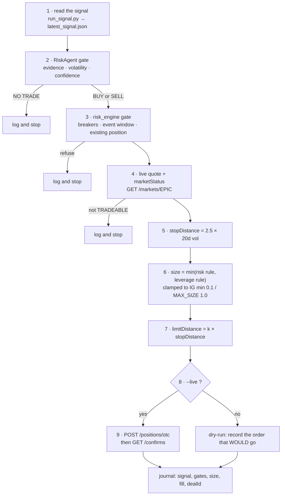

# Trading Discipline & Order Flow

A proposal, not a settled design. This is a research project: every number below
is meant to be overturned by evidence. What must NOT drift is which category a
rule belongs to — safety rails are fixed, strategy parameters are earned.

## The one idea everything else follows from

**Holding period, stop width, take-profit and position size are not four
independent knobs. They are one.** Pick the horizon and the other three are
determined:

| Horizon | Stop must be | Take-profit that makes sense | Resulting size | Signal that fits |
|---|---|---|---|---|
| ~20 days | wide enough to survive 20 days of noise (~350 pts on AUD/USD) | wider still, so it rarely fires | small | macro factors |
| ~2 days | ~30 pts | ~60 pts (2R) | larger | intraday flow / microstructure |

Mixing them is the failure mode: a 30-point stop under a 20-day macro signal
just buys noise, and the position is stopped out long before the thesis can play
out. **The current signal is calibrated at a 20-day horizon, so the 20-day row is
the only self-consistent choice available today.** Changing horizon means
changing signal, not just changing a number.

### Choosing a horizon: the three constraints

Shortening the horizon is tempting for a real reason — at 20 days there are only
~12 non-overlapping trades a year, so ten years yields ~120 observations and the
edge cannot be distinguished from noise within any useful timeframe. But cost and
data quota bound how far it can go. Derived from AUD/USD's measured ~7% annualised
vol (the signal's 4.93% stop is 2.5 × the 20-day vol), against IG's ~1-point
spread in liquid hours:

| Horizon | Typical move | Spread as % of move | Trades/yr | IG candles/yr | Verdict |
|---|---|---|---|---|---|
| 20 days | ~139 pts | 0.7% | ~12 | — | costs fine, **too few trades to learn from** |
| 1–3 days | ~31–54 pts | 1.9–3.2% | ~80–120 | ~1,560 (4H) | **viable** |
| 4 hours | ~13 pts | 7.7% | ~500 | ~1,560 | marginal |
| 5 minutes | ~1.8 pts | **55%** | thousands | ~75,000 | **not viable** |

Three separate walls stop the scalping end of that table:

1. **Cost.** At 5 minutes the spread exceeds half a typical move. A 10-point
   target against a 10-point stop with 1 point of cost needs a **55% hit rate**
   just to break even — above what this signal achieves at its best horizon.
2. **Data quota.** IG's price endpoint allows ~10k points/week and 1 candle = 1
   point. One year of 5-minute bars is ~75,000 points — about 7.5 weeks of
   quota for a single backtest. 4-hour bars are ~1,560/year, so six years fits
   in one pull.
3. **The signal does not transfer.** A 20-day DXY trend, the AU–US yield spread
   and iron ore have no predictive content over the next ten minutes. Scalping
   is not a parameter change; it discards the research platform and starts a
   different project on order flow and microstructure.

**The 1–3 day row is the one worth testing next**: costs stay tolerable, trade
count rises enough to reach a statistical verdict in a year or two rather than a
decade, and it fits 4-hour candles, which is also what the sibling `ig-demo-bot`
project already uses.

The price of moving there: **every factor must be re-validated at the new
horizon.** Most macro factors will likely lose their edge, leaving momentum and
short-horizon DXY direction. That has to be measured, not assumed.

## Tier 1 — safety rails (fixed, never optimised)

These are not strategy. They never get tuned after a loss, and they only ever
tighten.

1. **Demo only.** `BASE_URL` is pinned in `ig_client.py`, not in config.
2. **Every order carries a server-side stop.** `stopDistance` goes with the
   order so IG holds it — it fires with the machine off. No stop, no order.
3. **Size off a fixed notional of 10,000 AUD, never the account balance.** The
   Demo balance is ~1e8 AUD, which makes any "% of account" rule vacuous. A
   fixed notional keeps the rule meaningful and makes it behave the same way it
   would on a real account.
4. **Risk ≤ 1% of that notional per trade**, and never more than one open
   position per instrument.
5. **Circuit breakers**: −5% in a calendar month stops new entries for the
   month; −15% from the equity peak stops everything pending a manual review.
6. **No new entry within 2h of RBA/Fed decisions, CPI or payrolls.**

## Tier 2 — strategy parameters (earned, versioned, overturnable)

Each of these is a number that must be justified by a backtest, recorded in a
commit, and re-checked when changed. **Never adjust one after a losing trade.**

| Parameter | Current | Status |
|---|---|---|
| Holding period | 20 business days | Matches the horizon the signal is calibrated on |
| Stop distance | 2.5 × 20-day vol, clamped 4–12% | Wide by design — see below |
| Take-profit | none | **Unproven either way. Needs the A/B run.** |
| Position size | conflicting: see below | **Unresolved** |

### Why the stop is deliberately wide

Kaminski & Lo: under a random walk a stop-loss **always** lowers expected
return; it only pays when returns have positive serial correlation. A stop that
rarely fires costs almost nothing in expectation while still bounding gap risk —
which is what a 4–12% disaster stop is. A tight stop is an active bet that
AUD/USD 20-day returns are momentum-driven. **That is testable on our own data
and has not been tested.** Until it is, wide stays.

### Take-profit: send one, but derive it

Always sending both brackets is operationally better — the exit is then held by
IG rather than by a script that might not be running. So the design is:

    limitDistance = k × stopDistance

`k` is a single number chosen by backtest over `{none, 1.0, 1.5, 2.0, 3.0}` on
the 1/3/5/10-year windows. If the winner is "none", that is a *result*, proven on
our own data, rather than an assumption inherited from a prior replay.

Note what `k < 1` would mean: capping winners below the loss cap. With a 349-point
stop, a +2% target is `k ≈ 0.4`, which needs a >70% hit rate to break even against
a signal calibrated at 54.7%. So `k ≥ 1` is a hard floor on the search.

### Position sizing: an unresolved conflict

Two rules currently disagree by **10×** on the same trade:

- leverage 2.0 on 10,000 AUD → 20,000 AUD notional → **2.0 lots**
- 1% risk with a 349-point stop → **0.20 lots**

**Proposal: take the smaller.** This is the fractional-Kelly argument — the
penalty for overbetting far exceeds the cost of underbetting, and a 10%
error in the return estimate can translate into a ~50% overbet. Our return
estimate is far worse than 10% accurate.

## Order flow

What one trade does, end to end. Steps 1–2 exist; 3–9 are steps A.2/A.3.

Once a position is open, responsibility splits:

- **IG's servers** hold the stop and the limit. They fire whether or not
  anything of ours is running. This is the safety-critical half, and it is
  deliberately the half we do not control.
- **Our script** owns the time barrier and the signal-flip exit. Both need a
  process to be alive, so neither may be the only thing standing between the
  account and a large loss.

## What this does not fix

None of the above creates an edge. Risk rules change the shape of the return
distribution, not its sign — and the current 10-year backtest is −23% with a
Sharpe of −0.42. FX carry and momentum both decayed materially after 2008,
which is consistent with what this project measured independently: the combined
signal is net-negative while **carry alone ran at Sharpe +0.41 over ten years**.

So the ordering is: fix the signal first (ROADMAP step B), and treat everything
in this document as what keeps a *working* signal from ruining the account —
not as a way to rescue one that does not work yet.

## Verification checklist for any change here

1. Which tier does it touch? Tier 1 changes may only tighten.
2. Backtest over 1/3/5/10-year windows, costs included.
3. Compare against the current parameters on the same windows.
4. Commit the numbers with the change.
5. Nothing goes live until dry-run and paper agree for ≥3 months.
